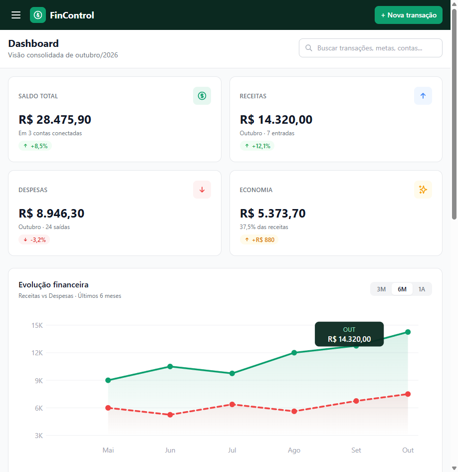

<p align="center">
  
</p>

<h1 align="center">💲 FinControl</h1>

<p align="center">
  <b>Sua Fintech Pessoal</b> — Dashboard de controle financeiro desenvolvido como atividade avaliativa da <b>FIAP</b>.
</p>

---

## 📖 Sobre o Projeto

O **FinControl** é um dashboard de gestão financeira pessoal que permite visualizar saldo total, receitas, despesas e economia de forma consolidada. A interface conta com gráfico de evolução financeira, listagem de transações recentes e integração com múltiplas contas bancárias.

Desenvolvido como parte da atividade **"Criar as Páginas do Fintech e subir o seu site no GIT"** do curso da FIAP, aplicando os conhecimentos de HTML, CSS e Tailwind CSS.

---

## 📸 Preview

<p align="center">
  
</p>

---

## 🛠️ Tecnologias Utilizadas

<p align="center">
  
  
  
  
</p>

| Tecnologia | Uso |
|---|---|
| **HTML5** | Estrutura semântica da página |
| **CSS3** | Estilos complementares (`styles.css`) |
| **Tailwind CSS** | Framework principal de estilização e responsividade |
| **Google Fonts (Inter)** | Tipografia da interface |

---

## 📂 Estrutura do Projeto

```
fincontrol/
├── index.html            # Página principal do dashboard
├── styles.css            # Estilos CSS complementares
├── index-screenshot.png  # Screenshot da tela
├── LICENSE               # Licença do projeto
└── README.md             # Documentação
```

---

## 🚀 Como Executar

1. Clone o repositório:
   ```bash
   git clone https://github.com/netoxp70/fincontrol.git
   ```
2. Abra o arquivo `index.html` diretamente no navegador.

> **Nota:** O projeto utiliza Tailwind CSS via CDN, portanto é necessário conexão com a internet para carregar os estilos corretamente.

---

## ✨ Funcionalidades da Tela

- **Cards de resumo** — Saldo total, receitas, despesas e economia com indicadores percentuais
- **Gráfico SVG** — Evolução financeira (receitas vs despesas) dos últimos 6 meses
- **Tabela de transações** — Últimas movimentações com categoria, conta e valor
- **Sidebar de navegação** — Menu lateral com seções do sistema
- **Contas conectadas** — Visualização de saldos por banco (Nubank, Itaú, XP)
- **Atalhos rápidos** — Ações frequentes como nova receita, nova despesa e exportar
- **Responsividade** — Layout adaptado para desktop e dispositivos mobile

---

## 📱 Responsividade

O projeto foi desenvolvido com abordagem **mobile-first** utilizando as classes responsivas do Tailwind CSS (`sm:`, `md:`, `lg:`, `xl:`), garantindo uma experiência adequada em diferentes tamanhos de tela.

---

## 👨‍💻 Autor

**Milton Neto** — Estudante FIAP

---

## 📄 Licença

Este projeto está sob a licença MIT. Consulte o arquivo [LICENSE](LICENSE) para mais detalhes.
